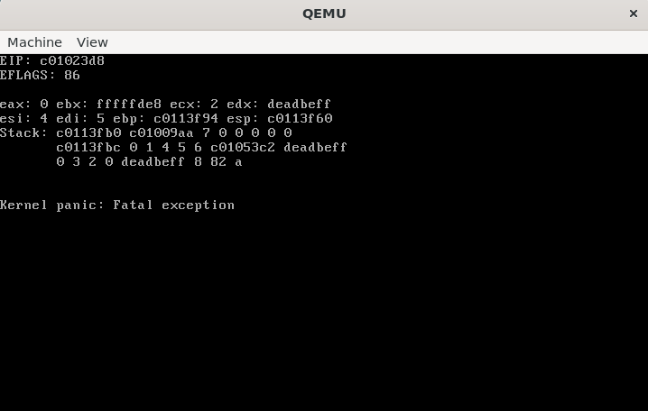

# KFS (kernel from scratch)

x86 기반의 Unix 스타일 커널을 구현한 프로젝트입니다.  
커널을 직접 설계하고 구현하여 추상적인 이해를 넘어서는 것을 목표로 합니다.

##  실행 방법

1. 필수 도구 설치
   - GCC 크로스 컴파일러
     - [OSDev Wiki - GCC Cross-Compiler](https://wiki.osdev.org/GCC_Cross-Compiler) 참고  
   - NASM (어셈블리어 빌드용)  
   - QEMU (에뮬레이터)  

2. 빌드 및 실행  
   ```bash
   make
   qemu-system-i386 -kernel kernel.elf -m <RAM_SIZE>

##  설계 및 구현

### 1. 메모리 관리

### 물리 메모리

부팅 시 커널은 GRUB Multiboot 정보 구조체에 포함된 메모리 맵을 통해 사용 가능한 물리 메모리 영역을 식별합니다.  
이후 식별된 영역을 버디 할당 시스템에 등록하여 물리 메모리를 관리합니다.   

물리 메모리 관리자는 세 가지 설계 방안을 검토한 끝에 비트맵 기반 버디 시스템을 채택했습니다.

| 방식 | 특징 | 시간 복잡도 | 다중 페이지 크기 지원 |
|------|------|--------------|------------------------|
| 스택 기반 | 가장 단순하고 빠름. 하지만 단일 페이지 크기만 지원 가능 | `O(1)` | ❌ |
| 비트맵 기반 | 여러 페이지 크기를 지원하지만, 검색이 느림 | `O(N)` | ✅ |
| 비트맵 기반 버디 시스템 | 비트맵보다 메모리를 약 2배 더 사용하지만, 큰 블록을 더 빠르게 탐색 가능 | `O(N)` | ✅ |

처음 설계 당시에는 다중 페이지 크기를 지원할 수 있는 구조를 염두에 두었으며,   
동시에 버디 시스템을 직접 구현해보고자 하는 목표도 있었습니다.   

#### 개선된 버디 시스템
기존 구현은 비트맵 기반 버디 시스템을 사용하여   
할당 시 블록을 탐색하는 과정에서 O(N)의 선형 탐색 비용이 발생하는 한계가 있었습니다.

이 문제를 해결하기 위해 새로운 설계가 도입되었으며,  
분할이 없는 경우 O(1), 분할이 필요한 경우에도 O(log n)으로 성능이 개선되었습니다.

#### 1) page 구조체    
물리 페이지마다 다음과 같은 메타데이터를 담는 struct page를 생성하여 관리합니다.
- order
- free list link
- reference count
- flags (free 여부)

free list 기반 구조를 사용하려면 각 페이지에 연결 리스트 링크가 필요하며,   
해제 시 버디 병합을 위해 free 여부와 order 정보도 필수적입니다.

#### 2) Free List
기존에는 각 order마다 비트맵을 두고 free 블록을 비트 단위로 탐색했지만,   
새로운 구현에서는 비트맵을 제거하고 각 order에 대해 free list를 유지합니다.   

이제는 비트맵을 순차적으로 탐색할 필요 없이 free list의 head에서 바로 page를 가져올 수 있습니다.

#### 3) page map
struct page를 물리 페이지 수만큼 배열로 생성하여,   
PFN을 인덱스로 사용해 O(1)로 페이지 메타데이터에 접근할 수 있습니다.   

이 덕분에 분할 과정에서 생성된 페이지들을 즉시 다룰 수 있으며,   
해제 시에도 free list를 탐색할 필요 없이 버디 페이지에 바로 접근해 병합을 처리할 수 있습니다.

#### 페이지 크기 정책
사용자 공간은 4KB 페이지를 사용하고, 커널 공간은 4MB 페이지를 사용합니다.   
큰 페이지를 사용할 경우 내부 단편화가 있는 페이지를 스왑 인할 때   
불필요한 데이터의 양이 커져 I/O 대기 시간이 길어질 수 있지만,   
커널은 스왑되지 않으므로 문제가 되지 않습니다.   

물론 큰 페이지는 내부 단편화가 크다는 단점이 있습니다.   
하지만 커널에서 단 하나의 페이지에서 발생하는 낭비는   
전체 메모리에서 차지하는 비중이 작아 큰 문제가 되지 않습니다.   
이러한 단편화는 유저 공간에서 여러 프로세스에 의해 누적될 때 큰 문제가 됩니다.   

또한 커널은 충분히 큰 가상 공간을 사용하므로,   
페이지 테이블 제거와 메타데이터 절감으로 얻는 메모리 이득을 고려하면   
내부 단편화로 인한 낭비는 어느 정도 상쇄됩니다.   

따라서 커널 영역에 큰 페이지를 사용하는 것은 실질적인 문제점이 거의 없습니다.   

큰 페이지의 주요 장점은 다음과 같습니다:   
- 가상 주소 관리 오버헤드 감소  
  → 4MB 페이지는 4KB 페이지보다 1024배 큰 영역을 단일 엔트리로 관리하므로,  
    관리해야 할 페이지 테이블 엔트리 수 또한 1024배 감소합니다.
  
- 페이지 워크 성능 향상    
  → 4MB 페이지는 2단계 페이징 구조 중 페이지 테이블 단계를 생략합니다.    
    따라서 페이지 워크 시 접근해야 할 메모리 참조 횟수가 줄어들어, 주소 변환 과정이 더 짧고 빠릅니다.
   
- TLB 효율 향상  
  → 일부 CPU는 4KB와 4MB 페이지의 TLB를 별도로 관리하기 때문에  
    유저 공간의 4KB 페이지 접근이 커널의 4MB TLB 엔트리를 밀어내지 않습니다.  
  → 통합형 TLB에서도 4MB 페이지는 4KB 페이지보다 1024배 넓은 영역을 단일 엔트리로 관리할 수 있어  
    TLB 미스율을 낮출 수 있습니다.

### 가상 주소 공간 

이 커널은 상위 절반 커널 모델(High-Half Kernel Model)을 채택하여,   
모든 프로세스의 가상 주소 공간 상위 절반(0xC0000000 ~ 0xFFFFFFFF)에 커널이 위치합니다.   
이 방식은 커널이 모든 프로세스의 주소 공간에 공통적으로 매핑되도록 하며,   
커널 페이지를 글로벌 페이지로 설정하여 문맥 교환 시에도 커널 영역의 TLB 엔트리가 flush되지 않도록 합니다.

#### 페이지 테이블 관리
페이지 테이블에 접근하려면 해당 페이지 테이블이 가상 주소 공간에 매핑되어 있어야 합니다.   
하지만 각 프로세스는 고유한 페이지 테이블을 가지고 있으며,   
커널이 사용할 수 있는 가상 주소 공간은 약 1GB로 제한되어 있습니다.   
따라서 모든 프로세스의 페이지 테이블을 커널 가상 공간에 전부 매핑할 수는 없습니다.   

한 가지 방법은 필요할 때마다 특정 프로세스의 페이지 테이블을 커널 공간에 매핑하고,   
작업이 끝나면 다시 매핑을 해제하는 것입니다.   
그러나 이 방식은 매번 매핑/언매핑과 TLB 무효화가 필요해 성능 오버헤드가 발생합니다.

이를 해결하기 위해 재귀적 페이징(recursive paging) 기법을 사용합니다.  
이는 페이지 디렉터리의 마지막 엔트리에 자기 자신(page directory)의 PFN을 저장하여   
MMU의 주소 변환 메커니즘을 이용해 페이지 테이블과 디렉터리에 바로 접근할 수 있도록 하는 방식입니다.

예를 들어
- `0xFFC00000` → 현재 프로세스의 첫 번째 페이지 테이블 엔트리 접근  
- `0xFFFFF000` → 현재 프로세스의 첫 번째 페이지 디렉터리 엔트리 접근

또한, 가상 주소로부터 해당 PTE/PDE의 주소,   
PTE 주소로부터 원래의 가상 주소를 간단한 비트 연산으로 변환할 수 있습니다.   
```C
/* addr → pte */
pte = 0xFFC00000
    | ((addr & 0xFFC00000) >> 10)
    | ((addr & 0x003FF000) >> 10);

/* addr → pde */
pde = 0xFFFFF000 | ((addr & 0xFFC00000) >> 20);

/* pte → addr */
addr = ((pte & 0x003FF000) << 10)
     | ((pte & 0x00000FFC) << 10);

```

재귀적 매핑 방식은 약 4MB의 가상 공간을 희생하지만, 접근 과정을 단순화하여 관리 효율을 향상시킬 수 있습니다.   

#### 커널 공간 관리
- 주소 범위: `0xC0000000 ~ 0xFFFFFFFF`  
- 페이지 크기: 4MB 페이지 (총 256개)  
- 가상 공간 크기: 1GB  
- 자료구조: linked list

커널 공간은 빠른 할당을 위해, 할당 가능한 블록들을 연결 리스트로 유지하여 관리합니다.  
커널은 4MB 페이지를 사용하므로 최대 256개의 페이지로 구성되며,  
병합이 이루어지는 특성 덕분에 실제로 관리해야 할 블록 수는 최악의 경우에도 약 128개 수준입니다.  
이는 연속된 가상 블록들 사이에 할당된 블록이 끼어 있어 free 블록들이 서로 병합되지 못하는,  
비정상적인 패턴에서만 나타나는 경우입니다.  
일반적인 커널 메모리 사용에서는 이러한 단편화가 거의 발생하지 않으며,  
실제로 관리해야 할 블록 수는 훨씬 적습니다.  
이러한 특성 덕분에 연결 리스트만으로도 충분히 효율적인 관리가 가능합니다.

#### 유저 공간 관리 
- 주소 범위: `0x00000000 ~ 0xBFFFFFFF`  
- 페이지 크기: 4KB 페이지 (총 786,432개)
- 가상 공간 크기: 3GB  
- 자료구조: Intrusive Red-Black Tree (2-way keyed)

유저 공간은 관리해야 할 블록의 수가 매우 많기 때문에  
연결 리스트만으로는 효율적인 탐색이 어렵습니다.  
(최대 약 40만 개의 가상 블록)

이를 해결하기 위해 레드블랙트리(Red-Black Tree)를 사용했습니다.  
다만, 단일 키로는 한계가 있습니다.

| 키 기준 | 장점 | 단점 |
|----------|------|------|
| 주소(Address) | 해제(병합) 빠름 | 할당 시 느림 |
| 크기(Size) | 할당 빠름 | 해제(병합) 느림 |

따라서 주소 기반 트리와 크기 기반 트리 두 개를 동시에 유지하는 구조를 채택했습니다.  
이를 효율적으로 관리하기 위해 Intrusive Data Structure 형태로 구현했으며,  
이를 통해 메모리 중복과 삭제 시 오버헤드를 최소화했습니다.  

또한, 유저 공간은 할당된 블록을 별도로 관리합니다.   
유저 메모리는 익명 메모리와 파일 매핑 메모리로 나뉩니다.   
익명 메모리는 단순히 페이지를 해제하면 되지만,   
파일 매핑은 참조 관리나 쓰기 반영 같은 추가 처리가 필요합니다.   
이 때문에 각 블록의 타입을 추적하는 정보가 필요합니다.

#### 지연 할당
가상 공간을 할당할 때, 물리 메모리는 즉시 할당되지 않습니다.    
대신 해당 공간에 실제 접근이 발생했을 때, 페이지 폴트 핸들러가 물리 페이지를 할당합니다.   
이 방식은 사용되지 않는 페이지의 낭비를 방지합니다.

### 힙 영역
힙 관리자는 임시 구현으로, 커널 완성 후 slab 할당자로 전환할 계획이 있었습니다.   
slab은 커널 내부에서 사용되는 객체들의 크기를 미리 알아야만 효율적으로 동작하지만,  
메모리 관리자는 커널 개발 초기에 구현되었기 때문에 당시에는 이러한 정보를 알 수 없었습니다.  
따라서 현재는 segregated free list 기반의 간단한 힙 관리자를 사용하고 있습니다.

#### 청크 구조
청크 구조는 ptmalloc2을 참고하여 설계되었습니다.

```c
struct malloc_chunk {
    size_t prev_size;
    size_t size;
    struct list_head list_head;
};
```

- `prev_size` : 이전 청크의 크기 (이전 블록으로의 역방향 접근용)  
- `size` : 현재 청크의 크기 (4바이트 정렬로 인해 하위 2비트 미사용)  
- `list_head` : 해당 크기 구간에 속하는 자유 청크 리스트

`size` 필드의 하위 2비트는 비트 플래그로 활용됩니다.

| 비트 | 의미 | 설명 |
|------|------|------|
| `PREV_INUSE` | 이전 청크가 사용 중인지 여부 | 해제 시 병합 판단에 사용 |
| `IS_HEAD` | 가상 블록의 시작 여부 | 가상 공간 반납 가능 여부 판단 |

#### 관리 방식
크기별로 분리된 여러 개의 free list 배열을 유지합니다.  
각 인덱스는 특정 크기 구간을 나타내며, 요청된 크기에 따라 적절한 리스트에서 검색이 시작됩니다.

| 인덱스 | 관리 크기 범위 |
|---------|----------------|
| 0 | 16B ~ 28B |
| 1 | 32B ~ 60B |
| 2 | 64B ~ 124B |
| … | 이후 동일한 규칙에 따라 확장 |

#### 할당

1. 구간 탐색:    
   요청 크기를 담을 수 있는 최소 구간을 찾은 뒤,  
   그 다음 구간부터 탐색을 시작합니다.  
   예: 36B 요청 시 → index 2부터 탐색  

2. 청크 탐색:    
   해당 구간의 리스트 head를 확인합니다.       
   사용 가능한 청크가 존재하면 즉시 반환하고, 존재하지 않으면 다음 구간의 head를 확인합니다.         
   각 구간의 리스트는 순회하지 않으며, 사실상 스택처럼 동작합니다.

4. 청크 분할:      
   청크가 요청 크기보다 크다면 남은 공간을 분할하여  
   적절한 구간의 free list에 삽입합니다.

5. 가상 공간 요청:      
   적합한 청크가 없을 경우 새로운 가상 주소 블록을 할당하여  
   힙 영역을 확장합니다.

#### 해제

1. 인접 청크 병합:      
   해제된 청크의 앞뒤가 free 상태라면 병합하여 더 큰 청크로 만듭니다.  

2. 리스트 삽입:      
   병합된 청크를 크기에 맞는 free list에 삽입합니다.  

3. 가상 블록 반납:      
   현재 청크가 가상 블록의 시작(`IS_HEAD`)이라면  
   블록 단위로 가상 주소 공간을 해제합니다.

#### 성능
- 할당: O(log N)  
- 해제: O(1)  
- 내부 단편화: 없음  
- 외부 단편화: 존재 (최소 구간이 아닌 “다음 구간”에서 탐색하고, 각 리스트를 순회하지 않기 때문)

### 2. 시스템 콜 인터페이스
시스템 콜 인터페이스는 내부 인터럽트 방식으로 구현되어 있습니다.   
또한 유저 라이브러리로 musl을 이식할 계획이 있었으며,   
사용자-커널 인터페이스는 Linux와 최대한 동일하게 설계했습니다.   
이를 통해 musl을 거의 수정 없이 사용할 수 있도록 하는 것이 목표였습니다.   

시스템 콜의 동작과 의미는 Linux man page 및 POSIX 문서를 참고하여 구현했으며,  
가능한 범위 내에서 해당 규격을 최대한 따르도록 구성했습니다  
(단, POSIX의 모든 옵션을 전부 구현한 것은 아닙니다).

#### 1) fork
fork는 부모 프로세스를 복제하여 새로운 자식 프로세스를 생성합니다.  
매핑된 물리 페이지들은 Copy-On-Write(COW) 방식으로 공유되며,  
실제 페이지 복사는 필요할 때만 이루어집니다.

##### 태스크 구조체 생성
새 프로세스를 생성하면 task_struct를 새로 만들고  
PID 비트맵에서 사용 가능한 PID를 할당합니다.  
UID, EUID, SUID, PGID, SID 등 프로세스 관련 정보는 부모의 값을 그대로 복사합니다.

##### 커널 스택 초기화
자식 프로세스는 독립적인 커널 스택을 가지고 시작합니다.  
부모의 레지스터 문맥을 기반으로 스택을 구성하여,  
자식이 처음 스케줄링될 때 부모와 동일한 실행 지점으로 복귀하도록 설정합니다.

- eax만 0으로 설정하여 fork의 반환값을 표현  
- 나머지 레지스터는 부모와 동일하게 복원  
- 최초 실행 시 트램폴린 코드(fork_child_trampoline)로 점프하도록  
  스택에 return address를 배치하여 제어 흐름을 구성

이 과정을 통해 자식은 부모와 동일한 컨텍스트에서 실행을 시작하되,  
fork의 반환값만 다른 독립적인 프로세스가 됩니다.

##### 가상 주소 공간 복제 및 COW 설정
fork 시에는 부모의 가상 주소 공간을 그대로 복제합니다.  

이후 페이지 단위로 COW를 설정하여  
두 프로세스가 같은 물리 페이지를 공유하도록 합니다.

- 페이지 테이블 엔트리는 새로 복사하여 자식이 독립적인 페이지 테이블을 가짐  
- 실제 페이지 데이터는 공유되며, PTE의 자유 비트를 사용해 COW 상태를 표시  
- 쓰기 가능한 페이지는 읽기 전용으로 전환  
- 공유된 페이지들의 refcount 증가  

쓰기 시점에는 페이지 폴트가 발생하고  
해당 페이지를 새로 할당한 뒤 내용을 복사하여 실제 분리가 이루어집니다.

##### COW 설계 결정
COW는 두 가지 방식이 존재하며, 본 프로젝트는 다음 이유로 1번 방식을 채택했습니다.

1. (채택) 매핑된 페이지에만 COW 적용, 페이지 테이블은 즉시 복사
2. (비채택) 페이지 테이블 자체도 COW 공유 후 필요 시 복사

2번 방식은 페이지 테이블까지 공유하는 방식이지만  
구현 복잡도 대비 실효 성능 개선 폭이 매우 제한적이었습니다.

표면적으로는  
4MB → 4KB → 4B 모두 1024배씩 줄어드는 구조이지만,  
실제 복사되는 데이터의 절대 크기를 비교하면 의미가 다릅니다.

- COW를 전혀 사용하지 않으면:  
  4MB 단위 메모리 전체를 복사해야 함
- 1번 방식에서는:  
  페이지 테이블 4KB만 복사하면 됨
- 2번 방식에서는:  
  PDE 하나(4B)만 복사하면 됨

즉, 가장 큰 비용인 4MB 복사만 피하면 대부분의 이득이 확보되며,  
4KB를 4B로 줄여 얻는 추가 개선폭은 상대적으로 매우 작습니다.  
이 때문에 구현이 복잡해지는 2번 방식은 선택하지 않았습니다.

##### 시그널 관련 정보 복사
부모가 등록한 시그널 핸들러는 모두 자식에게 복사됩니다.  
단, pending 상태의 시그널은 상속되지 않습니다.

##### 프로세스 그룹 및 스케줄링 준비
자식은 부모와 동일한 프로세스 그룹에 추가되며  
ready queue에 삽입되어 스케줄링될 수 있는 상태가 됩니다.

#### 2) _exit
_exit은 프로세스를 즉시 종료시키며, 프로세스가 보유한 자원들을 정리합니다.  
이 과정은 다음 순서로 진행됩니다.

##### 가상 주소 공간 자원 해제
커널이 관리하던 가상 주소 공간 메타데이터를 모두 해제합니다.  
이 과정에서 각 블록에 매핑되어 있던 물리 페이지들도 함께 회수됩니다.

##### 프로세스 그룹 정리
현재 프로세스는 소속된 프로세스 그룹에서 제거됩니다.  
제거 후 해당 그룹에 더 이상 프로세스가 없다면  
프로세스 그룹 자체도 삭제됩니다.

##### 고아 프로세스 처리
종료되는 프로세스가 자식 프로세스를 보유하고 있는 경우,  
고아 프로세스가 발생하지 않도록 모든 자식의 부모를 init 프로세스로 재설정합니다.

##### 즉시 해제되지 않는 자원들
_exit에서는 다음 자원들은 바로 해제되지 않습니다.

- PID  
- 페이지 디렉터리  
- 커널 스택  
- task_struct  

종료를 수행하는 동안에는 여전히 커널 코드가 실행 중이므로  
커널 스택과 페이지 디렉터리는 즉시 해제할 수 없습니다.  
또한 PID와 종료 상태는 부모 프로세스가 waitpid를 호출할 때 필요하므로  
부모가 회수할 때까지 유지됩니다.  
이 정보들은 모두 task_struct에 남아 있습니다.

##### 부모에게 종료 알림
부모에게 SIGCHLD 시그널을 전송합니다.  
부모가 SIGCHLD를 무시하도록 설정한 경우,  
부모는 자식의 종료 상태를 필요로 하지 않으므로  
즉시 자원을 해제할 수 있습니다.  

이 구현에서는 부모가 SIGCHLD를 무시할 경우  
종료된 프로세스의 부모를 init 프로세스로 설정하여  
init이 잔여 자원을 회수하도록 합니다.

##### 스케줄러에서 제거
종료 프로세스는 ready queue에서 제거되며,  
이후 다시 스케줄링되지 않습니다.

#### 3) waitpid
waitpid는 자식 프로세스의 종료를 감지합니다.  
지원되는 옵션은 WNOHANG 하나이며,   
중지나 재개 감지는 현재 구현되어 있지 않습니다.

##### 대기 대상 지정 방식
waitpid는 전달된 pid 값에 따라 다음과 같이 동작 대상을 결정합니다.

- pid > 0  
  특정 PID를 가진 자식 프로세스의 종료를 대기
- pid == 0  
  호출한 프로세스와 동일한 프로세스 그룹 내의 자식 종료를 대기
- pid < -1  
  -pid를 PGID로 하여 해당 프로세스 그룹 내의 자식 종료를 대기
- pid == -1  
  종료된 자식이 있으면 즉시 반환, 없으면 종료될 때까지 대기

커널은 PID 및 PGID 기준으로 조회하는 해시 테이블을 유지하며,  
waitpid는 이를 기반으로 대상을 탐색합니다.

##### 기본 동작
1. 대상 유효성 검사  
   - 전달된 pid 규칙에 따라 자식 프로세스를 탐색  
   - 대상이 없거나 호출한 프로세스의 자식이 아니면 즉시 오류 반환
2. 좀비 상태 확인 및 회수  
   - 종료된 자식이 있으면:  
     - __exit에서 처리되지 않은 나머지 자원을 정리  
     - 더 이상 종료된 자식이 없다면, 보류중인 SIGCHLD 신호는 지워짐
     - 종료 상태와 PID를 반환  
3. 대기 동작  
   - 종료된 자식이 없으면:  
     - WNOHANG이면 즉시 0 반환  
     - 그렇지 않으면 자식이 종료될 때까지 차단

##### 유저 공간 포인터 검증
종료 상태를 저장할 주소가 유저 공간이 맞는지,  
해당 주소가 할당된 공간의 주소인지 검사합니다.  
이를 통해 커널 주소 공간을 덮어쓰는 행위나  
잘못된 주소로 인한 페이지 폴트를 방지합니다.

##### 시그널 처리와 재시작
waitpid는 차단형 시스템 콜이므로 다음 시점에서 시그널 처리를 수행합니다.

- 차단에 들어가기 직전 pending 시그널이 있는지 검사  
- 차단 상태에서 깨어난 직후 pending 시그널 재확인  

시그널이 존재하면 waitpid는 즉시 중단되고 해당 시그널을 처리하며,  
처리 후 시스템 콜이 자동으로 재시작되도록 구현되어 있습니다.

#### 4) kill
kill은 지정된 프로세스 또는 프로세스 그룹에 시그널을 전송합니다.   
시그널 번호와 pid 값이 모두 유효한지 검사한 뒤,  
호출한 프로세스가 대상에게 시그널을 보낼 권한이 있는지 확인합니다.

##### pid에 따른 전송 대상
kill은 pid 값에 따라 다음과 같이 전송 대상을 결정합니다.

- pid > 0  
  해당 PID를 가진 프로세스에 시그널 전송
- pid == 0  
  호출한 프로세스와 동일한 프로세스 그룹 내의 프로세스들에 전송
- pid < -1  
  -pid를 PGID로 하여 해당 프로세스 그룹 내의 프로세스들에 전송
- pid == -1  
  호출한 프로세스가 시그널을 전송할 수 있는  
  모든 프로세스에 대해 시그널 전송

커널은 PID, PGID 기반으로 조회할 수 있는 해시 테이블과  
현재 실행 중인 모든 태스크를 연결한 리스트를 함께 유지합니다.  
kill은 pid 규칙에 따라 이 두 자료구조 중 적절한 쪽을 사용해 대상을 찾으며,  
특히 pid == -1인 경우 전체 태스크 리스트를 순회합니다.

##### 시그널 전송 방식
대상이 유효하고 권한 검사를 통과하면 시그널을 해당 프로세스의 pending 시그널 목록에 추가합니다.  
또한 대상 프로세스가 waiting 상태(차단 상태)인 경우   
즉시 깨워서 시그널을 처리할 수 있도록 합니다.

시그널의 기본 동작이나 핸들러 등록 여부에 따른 실제 처리 동작은  
프로세스가 사용자 모드로 복귀할 때 수행됩니다.

##### 시그널 처리 흐름
1. 복귀 직전 검사  
   - 커널이 유저 모드로 복귀하기 전에 현재 프로세스에 pending 상태의 시그널이 있는지 검사합니다.

2. 포착되지 않은 시그널 처리  
   - 핸들러가 등록되어 있지 않은 시그널은 기본 동작을 수행합니다(종료, 무시 등).

3. 포착된 시그널 처리
   - 유저 스택에 레지스터 문맥과 트램폴린 코드(trampoline) 를 저장합니다.  
   - 커널 스택을 조작하여, 유저 모드로 복귀할 때 시그널 핸들러가 호출되도록 설정합니다.
   - 시그널 핸들러가 return 하면, 트램폴린 코드가 실행되도록 유저 스택을 조작합니다. 
   - 트램폴린 코드는 sigreturn 시스템 콜을 호출하도록 설계되어 있습니다.

4. 핸들러 종료 후 문맥 복구 
   - sigreturn이 호출되면 커널은 유저 스택에 저장된 레지스터 문맥을 검증하고   
     복구한 뒤 원래의 유저 컨텍스트로 복귀합니다.

시그널 핸들러 실행 중 동일한 시그널이 다시 도착한 경우,   
재진입 문제를 방지하기 위해 즉시 처리되지 않고 pending 상태로 지연되며,   
핸들러가 종료된 후 다시 처리됩니다. 

#### 5) signal
signal은 특정 시그널에 대해 사용자 정의 시그널 핸들러를 등록합니다.  
시그널 번호가 유효한지, 포착 가능한 시그널인지 검사한 뒤  
해당 시그널의 핸들러를 프로세스의 시그널 핸들러 테이블에 저장합니다.

각 프로세스는 task_struct 내부에 시그널 핸들러 배열을 가지고 있으며,  
signal 호출 시 전달된 함수 포인터가 이 배열의 해당 시그널 인덱스에 등록됩니다.

SIGKILL, SIGSTOP과 같이 포착 불가능한 시그널은  
핸들러를 등록할 수 없으며, 시도할 경우 오류를 반환합니다.

지원되는 시그널은 다음과 같습니다.

```c
#define SIGINT      2
#define SIGILL      4
#define SIGABRT     6
#define SIGFPE      8
#define SIGKILL     9
#define SIGSEGV     11
#define SIGTERM     15
#define SIGCHLD     17
#define SIGCONT     18
#define SIGSTOP     19
```

#### 5) sigreturn
sigreturn은 시그널 핸들러 실행 이전의 사용자 문맥을 복구하여  
원래 실행 흐름으로 돌아가기 위한 시스템 콜입니다.  
유저 스택에 저장된 시그널 프레임을 읽어 레지스터 상태를 복원합니다.

##### 보안 검증
sigreturn은 잘못된 시그널 프레임을 통한 SROP 공격에 취약할 수 있기 때문에  
프레임 복원 전 다음 검증을 수행합니다.

- 시그널 프레임에 저장된 EIP가 커널 주소 공간을 가리키는지 검사  
  - 커널 영역을 가리킬 경우 즉시 SIGSEGV로 종료
- EFLAGS 복원 시, 사용자 플래그는 그대로 복원하지만  
  특권 레벨 관련 비트는 무시되고  
  커널이 저장해둔 원래의 특권 비트 값으로 덮어씁니다

x86의 iret 명령어 자체가 특권 전이를 하드웨어 레벨에서 보호하지만,  
추가적인 검증을 통해 이중 방어를 적용합니다.

### 3. 인터럽트
인터럽트는 예외와 하드웨어 인터럽트로 구성되어 있습니다.  

#### 예외



커널 모드에서 발생한 복구 불가능한 예외는 패닉으로 이어집니다.   
유저 모드에서 발생한 복구 불가능한 예외는 해당 프로세스에 적절한 시그널을 전송하여 종료시킵니다.

##### 페이지 폴트 
접근한 주소가 유저 공간인지 커널 공간인지에 따라 처리 방식이 달라집니다.

- 유저 공간 접근 시  
  - COW 페이지인지 확인  
  - 지연 할당되어 예약된 엔트리인지 확인
  - 둘 중 하나라면 정상적인 흐름으로 처리됨
  - 둘 다 아니라면 잘못된 접근으로 간주하고 SIGSEGV를 전송합니다.
- 커널 공간 접근 시  
  - 유저 모드에서 발생했다면 잘못된 커널 주소 접근이므로 해당 프로세스만 종료  
  - 커널 모드에서 발생했다면 커널 자체의 버그로 간주하고 패닉을 발생시킵니다.

#### 하드웨어 인터럽트
현재 하드웨어 인터럽트는 키보드와 PIT 두 가지를 지원합니다.

##### 키보드 인터럽트 (IRQ1)
현재는 US QWERTY 레이아웃만 지원합니다.   
키보드 인터럽트가 발생하면 PS/2 컨트롤러의 데이터 포트에서 스캔코드를 PIO 방식으로 직접 읽어오며,   
USB 키보드의 경우에도 USB Legacy 지원을 통해 PS/2 키보드처럼 에뮬레이션됩니다.   
읽어온 스캔코드는 문자로 변환되어 VGA 텍스트 모드 화면에 출력되며,   
이를 통해 메시지 출력과 키보드 입력 동작을 확인할 수 있는 기본적인 터미널 환경을 제공합니다.

##### PIT 타이머 인터럽트 (IRQ0)
PIT는 10ms 주기로 인터럽트를 발생시키며 스케줄링 타이머로 사용됩니다.  
tick 카운트를 증가시키고, 필요 시 스케줄러를 호출하여 다음 태스크로 전환합니다.

### 4. 스케줄링
스케줄러는 라운드 로빈 방식을 사용하는 선점형 멀티태스킹 구조입니다.   
다만, 이는 커널 기능 개발을 빠르게 완성하기 위한 임시 스케줄러로,   
이후에는 CFS와 같은 공평한 방식으로 교체할 계획이 있었습니다.   

#### 기본 동작
- 타임 슬라이스: 10ms  
- PIT 인터럽트(IRQ0)를 통해 매 10ms마다 스케줄링 시점이 도래합니다.  
- 현재 실행 중인 프로세스의 시간 할당이 만료되면, 큐 기반 구조를 통해  
  다음 프로세스가 선택되어 실행됩니다.

#### 선점 정책
- 유저 모드에서는 선점이 허용됩니다.  
- 커널 모드에서는 선점이 비활성화되어 있습니다.  

#### 문맥 교환
문맥 교환은 타이머 인터럽트에 의해 선점되거나,   
차단형 시스템 콜에서 프로세스가 자발적으로 CPU를 양보할 때 발생합니다.     

1. 커널 진입 시 자동 저장되는 문맥:  
   CPU는 자동으로 다음 레지스터를 커널 스택에 push 합니다.  
   → SS, ESP, EFLAGS, CS, EIP

2. 컴파일러가 저장하는 휘발성 레지스터:  
   함수 호출 규약(cdecl)에 따라 컴파일러는  
   휘발성 레지스터(EAX, ECX, EDX)를 push 합니다.

3. 커널이 저장하는 비휘발성 레지스터:  
   커널 스케줄러는 문맥 보존을 위해  
   비휘발성 레지스터(EBX, ESI, EDI, EBP)를 추가로 저장합니다.

4. 현재 프로세스 정보 저장:  
   현재 프로세스의 커널 스택 포인터(ESP)를  
   해당 프로세스의 task_struct에 저장하고,  
   current 포인터를 다음 실행할 태스크로 변경합니다.

5. 다음 프로세스 문맥 복원:  
   다음 프로세스의 task_struct에 저장된 항목을 로드합니다.  
   - CR3 (주소 공간 전환)  
   - 커널 스택 포인터(ESP)  
   - TSS.esp0 (유저→커널 전환 시 사용할 커널 스택)  
   - 비휘발성 레지스터 (EBX, ESI, EDI, EBP)  

6. 유저 모드 복귀:  
   휘발성 레지스터는 함수 epilogue에서 자동 복구되며,  
   IRET가 실행되면 EIP, ESP(유저 스택), EFLAGS가 복원되어  
   사용자 모드 실행이 재개됩니다.

##  테스트 및 검증
본 프로젝트는 구현된 기능의 안정성을 확인하기 위해 별도의 테스트 코드를 작성 및 검증하였습니다.          
관련 테스트 코드는 test/디렉토리에서 확인할 수 있습니다.

- 시스템 콜, 시그널, 스케줄링
   - 유저 모드에서의 정상 동작 보장을 위해, 임의로 유저 모드 환경에서 실행되도록 구성
   - 다양한 호출 및 시나리오를 통해 인터페이스의 정상 동작과 스케줄러의 안정성을 확인
- 메모리 관리
   - 메모리 할당/해제 과정을 반복 검증
   - 페이지 테이블 매핑/주소 변환 및 지연 할당 검증
- 커널 패닉 처리
   - 의도적으로 오류 상황을 발생시켜 커널 패닉 핸들러 동작을 검증
   - 에러 시점의 레지스터 값과 스택 트레이스가 정확히 출력되는지 확인
   - 포맷이 의도한 대로 일관성 있게 출력되는지 확인
