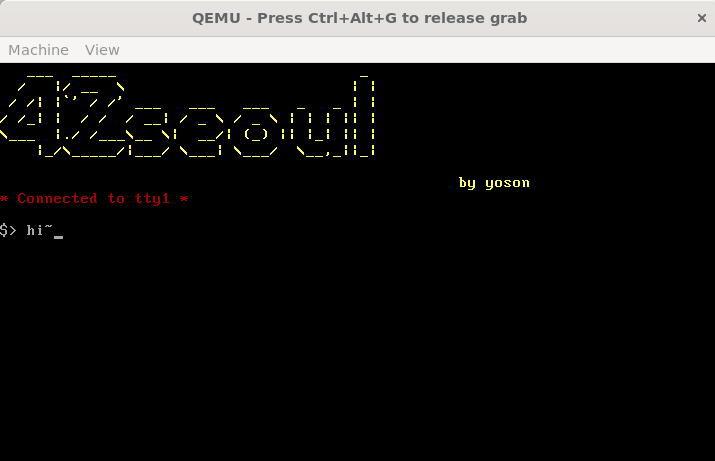
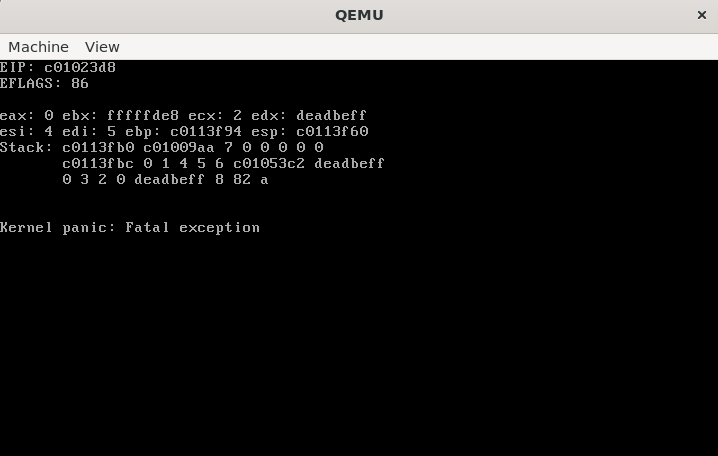

# KFS (kernel from scratch)



x86 기반의 Unix 스타일 커널을 구현한 프로젝트입니다.  
커널의 모든 부분을 직접 설계하고 구현하여 추상적인 이해를 넘어서는 것을 목표로 합니다.

##  실행 방법

1. 필수 도구 설치
   - GCC 크로스 컴파일러
     - [OSDev Wiki - GCC Cross-Compiler](https://wiki.osdev.org/GCC_Cross-Compiler) 참고  
   - NASM (어셈블리어 빌드용)  
   - QEMU (에뮬레이터)  

2. 빌드 및 실행  
   ```bash
   make
   qemu-system-i386 -kernel kernel.elf -m <RAM_SIZE>

##  설계 및 구현

### 1. 메모리 관리

#### 1-1. 물리 메모리
- buddy system으로 구현
   - free stack보다 느리지만 다중 페이지 크기 지원 가능
- 유저 공간은 4KB 페이지, 커널 공간은 4MB 페이지 사용
   - 큰 페이지와 작은 페이지가 TLB에서 별도의 엔트리를 사용하는 아키텍처에서 커널 TLB 미스가 발생하지 않음

#### 1-2. 가상 주소 공간
- 상위 절반 커널 모델
- 커널 공간
  - 노드의 최대 개수가 127개 → linked list로 충분
  - free space를 linked list로 관리
- 유저 공간
  - 노드의 최대 개수가 약 수십만 → linked list로 충분하지 않음
  - red-black tree로 관리
    - allocated space는 주소를 key로 갖음
    - free space는 주소를 key로 가지면 할당이 느려지고, 크기를 key로 가지면 해제가 느려짐
      - intrusive data structure 형태의 주소, 크기 모두를 key로 갖는 구조로 최적화 
- 지연 할당
  - 가상 공간만 할당하고 물리 메모리는 실제로 접근될 때 할당 → 메모리 낭비 최소화

#### 1-3. 힙 메모리
- segregated free list 기반 관리
  - 크기 구간별로 free list 배열을 구성
  - index 0: 16B ~ 28B
  - index 1: 32B ~ 60B
  - index 2: 64B ~ 124B
  - … (이후 동일한 규칙에 따라 확장)
- 할당
  - 구간 탐색: 요청 크기를 담을 수 있는 최소 구간을 찾고, 그 구간의 다음 구간부터 탐색을 시작함
     - 예: 36B 요청 시 → index 2부터 탐색
  - 청크 탐색: 해당 구간의 리스트 head를 확인하여 사용 가능한 청크가 있으면 바로 사용
  - 청크 분할: 청크가 요청 크기보다 크다면, 남은 공간을 분할하여 적절한 구간에 삽입
  - 적합한 청크가 없을 경우, 새로운 가상 주소 공간을 할당
- 해제
  - 인접 청크 병합 이후 적절한 구간에 삽입

### 2. 시스템 콜 인터페이스
- fork
  - 프로세스를 복제
  - COW 기반: 페이지 테이블만 즉시 복사, 실제 메모리는 쓰기 시 복사
- waitpid
  - 자식 프로세스의 상태 변화를 대기
  - 좀비 상태 자식이 없으면 새로 생길 때까지 차단
  - WNOHANG 옵션 시 비차단 동작
- _exit
  - 프로세스를 즉시 종료
  - 자원 회수 후 부모 프로세스에 SIGCHLD 전송
  - 부모가 waitpid 호출 전까지 좀비 상태 유지
- signal
  - 시그널 핸들러 등록
  - 포착 불가능한 시그널은 등록 불가
- kill
  - 대상 프로세스에 시그널 전송
  - waiting 상태 프로세스를 ready 상태로 깨움
- sigreturn
  - 시그널 처리 전의 문맥을 복구


### 3. 인터럽트
- 키보드: 터미널 입력 처리
- PIT: 시분할 스케줄링 구현


### 4. 스케줄링
- 선제적 멀티태스킹
  - 모든 프로세스에 10ms 타임 슬라이스 부여
  - PIT 기반 구현
- 비선점 커널
  - 커널 모드에서는 선점되지 않음
  - 선점형 커널보다 응답 속도는 낮지만, 처리량은 높음


### 5. 시그널
- 지원
   - ISO C 표준 신호
   - 일부 POSIX 신호
- 처리 흐름
  - 커널 모드에서 유저 모드로 복귀하기 전에 pending 상태 시그널이 있는지 확인
  - 포착되지 않은 시그널
    - 기본 동작 수행 (종료, 무시 등)
  - 포착된 시그널
    - 유저 스택에 레지스터 문맥과 트램펄린 코드를 저장
    - 커널 스택을 조작하여, 유저 모드 복귀 시 시그널 핸들러가 실행되도록 설정
    - 시그널 핸들러가 return 하면, 트램펄린 코드가 실행되도록 유저 스택을 조작
    - 트램펄린 코드는 sigreturn 시스템 콜을 호출
    - 커널은 유저 스택에 저장된 레지스터 문맥을 복구하고, 다시 유저 모드로 복귀


### 6. 예외 처리



- 커널 모드
   - 복구할 수 없는 예외가 발생하면 해당 시점의 레지스터 상태와 커널 스택을 출력한 뒤, 시스템을 중지
- 유저 모드
   - 복구할 수 없는 예외가 발생하면 해당 프로세스에 적절한 시그널을 전송하여, 프로세스를 강제 종료

##  테스트 및 검증
본 프로젝트는 구현된 기능의 안정성을 확인하기 위해 별도의 테스트 코드를 작성 및 검증하였습니다.          
관련 테스트 코드는 test/디렉토리에서 확인할 수 있습니다.

- 시스템 콜, 시그널, 스케줄링
   - 유저 모드에서의 정상 동작 보장을 위해, 임의로 유저 모드 환경에서 실행되도록 구성
   - 다양한 호출 및 시나리오를 통해 인터페이스의 정상 동작과 스케줄러의 안정성을 확인
- 메모리 관리
   - 메모리 할당/해제 과정을 반복 검증
   - 페이지 테이블 매핑/주소 변환 및 지연 할당 검증
- 커널 패닉 처리
   - 의도적으로 오류 상황을 발생시켜 커널 패닉 핸들러 동작을 검증
   - 에러 시점의 레지스터 값과 스택 트레이스가 정확히 출력되는지 확인
   - 포맷이 의도한 대로 일관성 있게 출력되는지 확인
